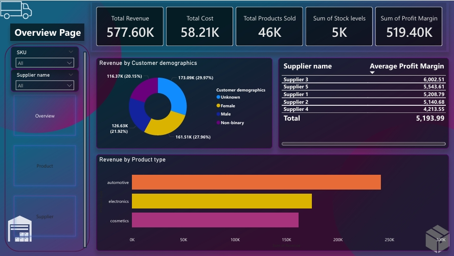
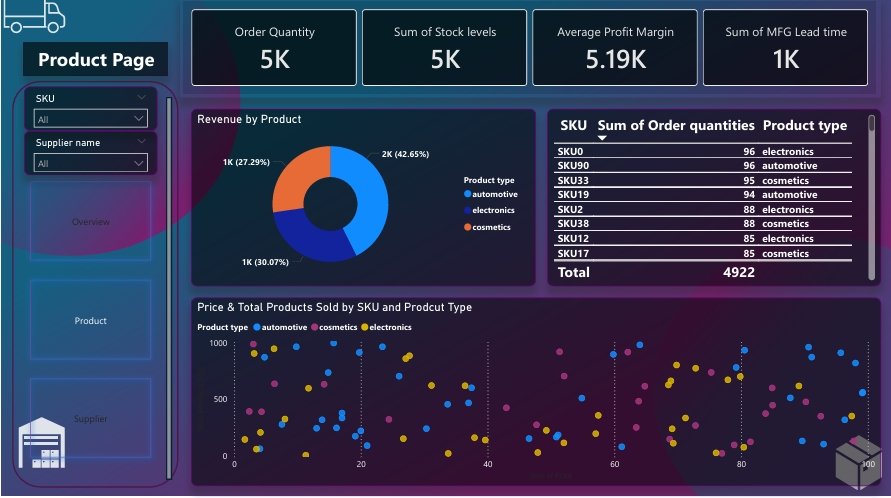
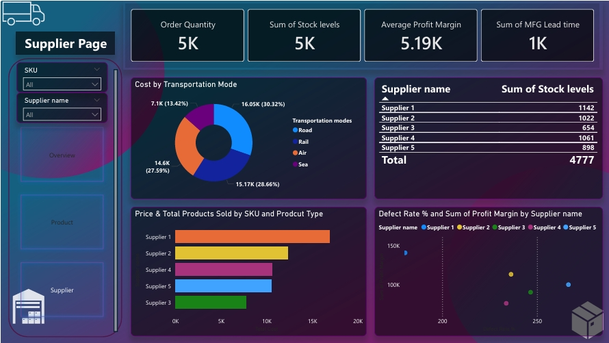

# Supply-Chain-Operations-Dashboard-PowerBI

An interactive Power BI dashboard designed to analyze supply chain data, providing insights into revenue, product sales, costs, supplier performance, and operational efficiency.

----------------

## 📊 Project Overview

This project demonstrates end-to-end supply chain performance analysis using Power BI.

The dashboard provides visibility across:

- Revenue and profit trends

- Product sales performance

- Supplier efficiency and defect rates

- Inventory and stock levels

- Transportation cost analysis

----------------

> ⚠️ Note: This dataset is synthetic and used only for learning purposes.

----------------

## 🎯 Business Objectives

The dashboard helps to:

1. Monitor supplier lead time and performance

2. Analyze inventory stock levels and defects

3. Evaluate transportation costs by mode

4. Track revenue, cost, and profit margin

5. Support proactive supply chain decision-making

----------------

## 🧠 Business Problems Addressed

* Identifies inventory imbalance and stock inefficiencies

* Evaluates supplier contribution to profit margin

* Tracks defect rate trends by supplier

* Analyzes transportation mode cost distribution

* Provides revenue breakdown by customer demographics and product type

----------------

## 📈 Key KPIs

| KPI | Value |
|----|----|
| Total Revenue | 577.60K |
| Total Cost | 58.21K |
| Total Products Sold | 46K |
| Total Stock Level | 5K |
| Avg Profit Margin | 5.19K |

----------------

## 🛠 Technical Implementation

* Designed an interactive Power BI dashboard with slicers, drill-through functionality, and page navigation.

* Implemented dynamic DAX measures to calculate:

* Total Revenue
 
* Order Quantity

* Profit Margin

* Defect Rate %

* Optimized data modeling and table relationships to ensure data integrity and performance.

* Created KPI cards and analytical visuals for executive-level insights.

----------------

## 🔎 Dashboard Pages

1️⃣ Overview Page

  

* Revenue & Cost KPIs

* Revenue by Customer Demographics

* Revenue by Product Type

* Supplier Profit Margin Analysis

---

2️⃣ Product Page

  

* Order Quantity Metrics

* Revenue by Product

* SKU-Level Sales Analysis

---

3️⃣ Supplier Page

  

* Cost by Transportation Mode

* Stock Levels by Supplier

* Defect Rate vs Profit Margin
 
----------------

## 🚀 Project Impact

This project strengthened my understanding of:

* End-to-end Business Intelligence workflows

* KPI-driven analytics

* Data modeling and performance optimization

* Translating business problems into actionable dashboards

----------------

---

⭐ If you found this project helpful, feel free to connect or share feedback.
